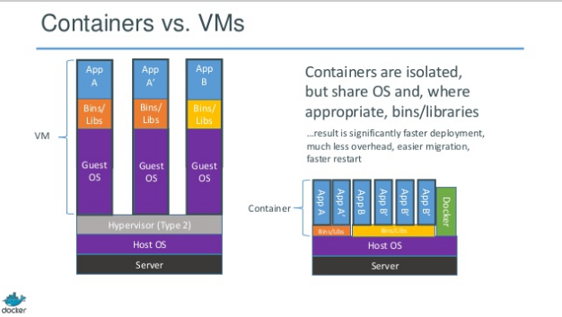

# docker

# the problem... shipping code to the server to is too hard
* different languages (versions, patches)
* different frameworks / libraries (versions, patches)
* different hardware (versions, patches)
  * developer's pc / test / uat / training / production servers (virtual / physical)

# benefits
* enables apps to be quickly assembled from components and eliminate the friction between development, qa, and production environments
* with docker, developers can build any app in any language using any toolchain 
“dockerized” apps:
  * are completely portable
  * are sandboxes from other processes (apps are run inside containers)
  * can run anywhere

# docker terminology
* docker command line interface (CLI)
* image
* container
  * a docker container is created from an image
* repository

# what is docker?
* docker is a container.
* while a "virtual machine" is a whole other guest computer running on top of your host computer (sitting on top of a layer of virtualization), docker is an isolated portion of the host computer, sharing the host kernel (OS) and even its bin/libraries if appropriate
* docker uses kernel cgroup and namespacing via lxc
  * it means that you are using the same kernel as the host and the same file system
* you can use "Dockerfile" with the docker build command in order to handle the provisioning and configuration of your container
* to put it in an over-simplified way, if I run a CoreOS host server and have a guest docker container based off of Ubuntu, the docker container contains the parts that make Ubuntu different from CoreOS

# vms vs containers

# links
* [docker.com; what is docker](http://www.docker.com/whatisdocker/)
* [docker.com; user guide; using docker](https://docs.docker.com/userguide/usingdocker/)
* [docker.com; user guide; docker images](https://docs.docker.com/userguide/dockerimages/)
* [docker.com; user guide; docker links](https://docs.docker.com/userguide/dockerlinks/)
* [docker.com; hub](https://hub.docker.com/)
* [getting-started-with-docker article](https://serversforhackers.com/getting-started-with-docker)
* [New Docker Desktop Filesharing Features](https://youtu.be/gyddZyc8r48)

