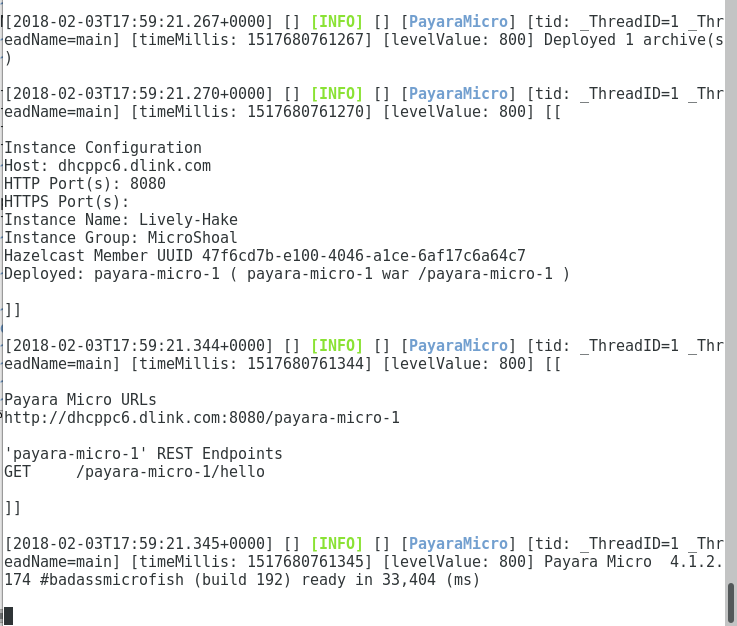
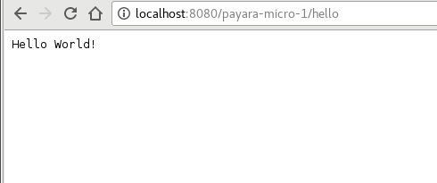

# enterprise java - micro profile

## context
* enterprise java technologies like java ee have evolved with the industry for nearly two decades to support distributed application architectures based on soap and rest web services. micro-profile is the next step in that evolution


## what?
* "MicroProfile" is an eclipse foundation project based on a specification for a set of apis appropriate to building microservices
* the project was announced in june 2016 by a number of java industry vendors & community groups including payara, redhat, ibm, tomitribe, ...
* micro-profile is a baseline platform definition that optimizes enterprise java for a microservices architecture and delivers application portability across multiple MicroProfile runtimes. while java ee is a very feature rich platform and is like a toolbox that can be used to to address a wide variety of application architectures, micro-profile focuses on defining a small and a minimum set of java ee standards that can be used to deliver applications based on a microservice architecture, they are:
  * JAX-RS
  * CDI
  * JSON-P


## why?
* the whole philosophy is to turn the idea of application servers on its head and change the perception that they are large, complex and unwieldy environments for building server side applications
* it enables you to run war files from the command line without any application server installation


## benefits
* it is small, less than 70MB in size
* perfect for container projects (e.g. using docker)


## specification versions
* version 1.0
* version 1.1 
* version 1.2
* version 1.3 <- current version (vendor implementations are in progress)


## how?
* create enterprise java project as normal that builds a war file e.g. with maven pom dependency javax javaee-api
* download a vendor micro profile jar file
* use command-line to execute the vendor jar file with the enterprise java project war file as a parameter


```
java -jar payara-micro-4.1.2.174.jar --deploy payara-micro-1/target/payara-micro-1.war
```








## microprofile projects


### config
* [microprofile-config](https://microprofile.io/project/eclipse/microprofile-config)
* [JSR 382: Configuration](https://www.youtube.com/watch?v=EBbFcaUx2Sk)


### metrics
* [microprofile-metrics](https://microprofile.io/project/eclipse/microprofile-metrics)
* [MicroProfile Metrics: Practical Use Cases](https://www.youtube.com/watch?v=eUiXJWDy_g0)


### fault tolerance
* [microprofile-fault-tolerance](https://microprofile.io/project/eclipse/microprofile-fault-tolerance)
* [Preview: MicroProfile Fault Tolerance in Payara Micro](http://blog.payara.fish/preview-microprofile-fault-tolerance-in-payara-micro?utm_campaign=Payara%205%20Launch)


### health
* [microprofile-health](https://microprofile.io/project/eclipse/microprofile-health)


### jwt auth
* [microprofile-jwt-auth](https://microprofile.io/project/eclipse/microprofile-jwt-auth)


### open api
* [microprofile-open-api](https://microprofile.io/project/eclipse/microprofile-open-api)


### open tracing
* [microprofile-opentracing](https://microprofile.io/project/eclipse/microprofile-opentracing)


### rest client
* [microprofile-rest-client](https://microprofile.io/project/eclipse/microprofile-rest-client)


## links
* [microprofile.io website](https://microprofile.io/)
* [eclipse micro-profile project wiki](https://wiki.eclipse.org/MicroProfile)
* [eclipse micro-profile project wiki - implementations page](https://wiki.eclipse.org/MicroProfile/Implementation)
* [eclipse project proposal](https://projects.eclipse.org/proposals/eclipse-microprofile)
* [source code on github](https://github.com/microprofile)
* [payara micro website](https://www.payara.fish/payara_micro)
* [MicroProfile: Optimizing Java EE for a microservices architecture](https://www.youtube.com/watch?v=YGC2b8k2nfg&feature=youtu.be)
* [Microprofile - by Example : Ivar Grimstad](https://vimeo.com/233982410)

